  

---

### ⚡ About Me

Computer Science student (2023–2027) at **Sri Krishna College of Technology** and aspiring **Software Development Engineer (SDE) & AI Engineer**. Hands-on experience engineering full-stack web applications utilizing **Java**, **Python**, **Spring Boot**, **React.js**, and **MySQL**. Proficient in building scalable RESTful APIs, optimizing relational database architectures, and integrating AI models for enterprise and academic environments.

---

### 🚀 Featured Projects

* 🕹️ **[ALGO3D — Algorithm Visualizer](https://github.com/ashwath2005/ALGO3D-)**  
  *Cinematic 3D spatial simulation and benchmarking laboratory for Data Structures & Algorithms.*  
  `React` • `Three.js (R3F)` • `Web Audio API` • `WebGL`

* 🌐 **[Interactive 3D WebGL Portfolio](https://ashwath-s-portfolio.netlify.app/)**  
  *High-FPS 3D WebGL portfolio featuring particle warp physics, Lenis smooth scrolling, and spatial sound synthesis.*  
  `React 19` • `TypeScript` • `Three.js` • `Framer Motion` • `Vite`

* 🛡️ **[ARCHON — AI Architecture Review & Governance](https://github.com/ashwath2005/archon-ai-governance)**  
  *Full-stack GenAI architecture review network with Decision + Reasoning validation and interactive DAG pipeline graphs.*  
  `Spring Boot 3` • `React 18` • `MySQL 8` • `Spring Security 6` • `JWT & RBAC`

* 🎓 **[Smart Campus AI](https://github.com/ashwath2005)**  
  *AI-powered college management platform with Google Gemini assistant for study planning, quizzes, and placement prep.*  
  `FastAPI` • `React.js` • `TypeScript` • `Google Gemini API`

* 🏢 **[Anbunithi Agencies Website](https://anbunithiagencies.in)**  
  *Production e-commerce platform with dynamic PDF brochure generation and Redux state management.*  
  `React.js` • `Vite` • `Tailwind CSS` • `Three.js` • `Redux Toolkit`

* 📅 **[Smart Timetable Generator](https://github.com/ashwath2005/timetable-generator)**  
  *Automated multi-constraint academic scheduling engine with automated conflict resolution.*  
  `Java` • `Spring Boot` • `MySQL` • `RESTful APIs`

---

### 🛠️ Tech Stack

* **Languages**: Java, Python, JavaScript, TypeScript, SQL, HTML5, CSS3
* **Frameworks & Libraries**: Spring Boot, React.js, FastAPI, Redux Toolkit, Tailwind CSS, Three.js, Framer Motion
* **Databases & Cloud**: MySQL, MongoDB, AWS (EC2, S3), Kubernetes, Terraform
* **Tools & Core Skills**: Git/GitHub, Docker, Vite, Postman, OOP, DBMS, REST APIs, Data Structures & Algorithms (DSA)

---

### 📜 Leadership & Certifications

* 🏛️ **Editorial Board Director** — *Rotaract Club of SKCT (2025 – Present)*
* 🎓 **Cisco Networking Academy** — *Python Essentials 1 & 2, Introduction to Data Science, Modern AI, Cybersecurity Fundamentals*

---

  © 2025–2027 <b>Ashwath S</b> • Built with precision

